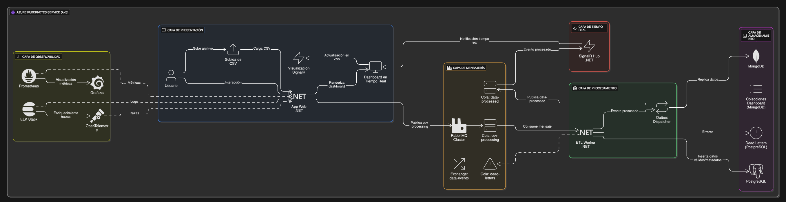

# Practica3
## Arquitectura integral (WebSocket / SignalR — C# .NET) — paso a paso
1.	Ingesta (archivo CSV)
o	Usuario sube CSV a POST /api/upload o se coloca en carpeta data/inbound/.
o	El API guarda archivo en ./data/inbound/ y publica un mensaje en la cola interna (o RabbitMQ si quieres).
2.	Orquestador / Notificación
o	FileSystemWatcher o publicación a RabbitMQ (cola files.pending) notifica al servicio ETL que hay un archivo nuevo.
3.	ETL Worker (.NET Worker Service)
o	Consume notificaciones, abre CSV con CsvHelper, lee en streaming.
o	Extract → Transform → Load: validar, limpiar, transformar.
o	Para cada registro limpio crea ProcessedRecord.
4.	Persistencia (Load)
o	Inserta en SQL (PostgreSQL o SQL Server) usando EF Core / Dapper en batch.
o	Inserta en MongoDB como documento (para consultas flexibles).
5.	Publicación en tiempo real
o	Cada ProcessedRecord después de guardarlo, el Worker llama al SignalR Hub del Backend (RealtimeHub) para broadcast a los clientes conectados o a grupos (p.ej. por sensorId).
o	Esto usa WebSockets por debajo (SignalR abstrae).
6.	API / Servicios
o	Backend.API (ASP.NET Core) expone endpoints REST (histórico, filtros) y el SignalR Hub para la comunicación en tiempo real cliente–servidor.
7.	Cliente / Dashboard
o	Web (Razor/Blazor o SPA) se conecta al Hub SignalR, recibe eventos en vivo y actualiza Chart.js (o alguna librería de gráficos).
8.	Manejo de errores / idempotencia
o	Cada registro tiene uniqueId (guid o hash) → evita duplicados.
o	Dead-letter para filas con error, logs y métricas.
## Diagrama de arquitectura

